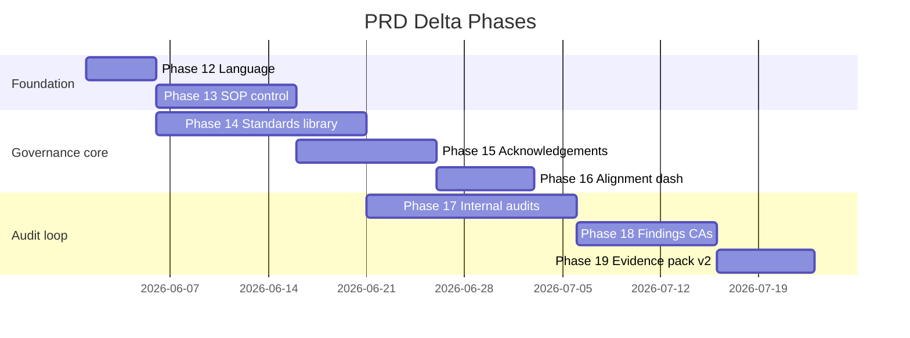

# Aquilens PRD Delta Plan (Phases 12–19)

**Source:** `aquilens_product_requirements.md`  
**Baseline:** Phases 0–11 complete (process execution + audit trail)  
**Strategy:** Extend existing entities where possible; add new modules only where the PRD introduces distinct lifecycles (standards library, acknowledgements, internal audits, findings, corrective actions).

---

## Locked build decisions

| # | Topic | Decision |
|---|--------|----------|
| 1 | Process vs SOP | **One SOP per process** — keep `processes` + `process_versions`; UI labelled “SOP”. No separate `sops` table for MVP. |
| 2 | Demo vs Supabase | **Both** — every Phase 12–19 feature must work in **in-memory demo stores** and **Supabase** (same pattern as workflows, agents, processes). |
| 3 | Guidance pack authoring | **Developer-only for MVP** — SQL migrations + demo seed. **No** Aquilens staff portal yet. **Later:** internal staff portal for pack lifecycle (§4 of repository). |
| 3b | Pack content source of truth | [`aquilens_standards_repository.md`](../aquilens_standards_repository.md) at repo root (curated packs, audit checks, applicability rules). Not `standards.md` — use this file when building Phase 14 seeds. |
| 4 | Build order | **Strictly sequential:** 12 → 13 → 14 → 15 → 16 → 17 → 18 → 19. No parallel phase work. Each phase completes **Builder → Tester → Approver** in the gated workflow before the next phase opens. |
| 4b | Quality gate per phase | **Code review** on every handoff: demo vs Supabase parity, schema/validation vs seed data, no carried-forward bugs. Approver checks plan compliance + documentation + review findings (use code-review skill for non-trivial phases). |
| 5 | Demo seed strategy | **Update `seed:demo` at the end of each phase** so new tables/validators are exercised immediately (catches schema/seed mismatches early). One consolidated seed script is fine internally as long as each phase’s data is present before Tester runs. |
| 6 | Staff + Standards Alignment | **Staff cannot access** `/alignment` or alignment summary widgets — avoid overwhelming frontline users. Alignment for Admin, Compliance, Department Owner, Auditor (and roles explicitly granted). |
| 7 | Publish vs live status | When an SOP is approved and goes live, **process/version operational status is `active`** (not a separate “published” process flag). **Audit log / timestamps required:** `approved_at`, `approved_by`, `effective_at` (went live), and actor for go-live where distinct from approval. |
| 8 | Acknowledgements | On publish, assign to **every user linked to that department** (function), not all-tenant and not role-filtered to “Staff” only. |
| 9 | Evidence pack export (Phase 19) | **PDF + CSV only** for MVP. No DOCX/XLSX in v1. |
| 10 | External viewers | **Extend existing guest access** (read-only pack / alignment links). No new External Viewer RBAC role for MVP. |
| 11 | UI testing | **Playwright required** — every phase with UI must add/update `apps/web/e2e/*.spec.ts` for `P*-UI-*` cases; Tester runs Playwright in addition to API tests. |
| 12 | Organisation profile | **Sector-agnostic platform** (schools are one `institution_type`, not the whole product). Extend existing tenant model: `tenants.institution_type` + `tenants.settings` jsonb + optional `organisation_profile` jsonb (same pattern as onboarding today). Pack recommendations use `institution_type`, country, and profile — not school-only assumptions. |
| 13 | Multi-site / locations | **Defer** past Phase 14 unless a phase acceptance criterion explicitly requires it. |
| 14 | AI for standards | **Rule-based recommendations only** for MVP (`institution_type`, country, selections). AI assist for pack authoring remains **staff-portal / later**. |

### Product positioning (all phases)

Aquilens serves **any organisation with processes and procedures** (schools, hospitals, finance, NGOs, corporate, government). GIS demo tenant is a **school example**, not a product constraint. UI copy, seeds, and tests must include at least one non-school path or institution-type branch where behaviour differs.

### Gated workflow (per phase)

1. **Builder** — implement current phase only; update demo seed for this phase; run focused API + lint/build.  
2. **Tester** — API tests + **Playwright** for UI cases in scope; regression on prior phases’ critical paths.  
3. **Approver** — code review, documentation inside `project_folder`, plan compliance; unlock next phase only on `APPROVED`.  
4. Do not start phase N+1 until phase N is `APPROVED`.

### Phase 14 content pipeline (from repository file)

1. **MVP import (PRD §23.2 — six packs):** map repository sections → DB slugs:
   - `universal-sop-control` ← PACK-AQL-000
   - `iso-9001-quality` ← PACK-ISO-9001
   - `school-operations` ← composite for schools: UK School Safeguarding + Ghana School Safety + Ofsted (or single “School Operations” pack distilled from §7 school packs — document choice in Phase 14 Builder)
   - `health-and-care` ← PACK-CQC (primary) ± ISO 15189 for labs if needed later
   - `iso-27001-security` ← PACK-ISO-27001
   - `iso-45001-hse` ← PACK-ISO-45001
2. **Phase 14+ backlog:** repository §12 lists 10 packs for first product build (adds ISO 10013, ISO 19011, UK/GH data protection). Import via additional migrations — not all in day-one MVP unless Approver expands scope.
3. **Import mechanics:** prefer `scripts/import-guidance-packs.mjs` reading structured sections from `aquilens_standards_repository.md` → generates SQL or loads Supabase directly; keeps repo file and DB in sync.
4. **Copyright:** import only Aquilens summaries + audit checks from repository; never paste full ISO/FCA text (per repository §1).

### Implementation rule for “both”

For each new module (`standards`, `acknowledgements`, `alignment`, `internal-audits`, `findings`):

1. Add a `*-demo.store.ts` with `reset*DemoStore()` for tests and `npm run seed:demo`.
2. Service layer: `getSupabaseAdminClient()` → Supabase path; else → demo store (never silent no-op in production).
3. API tests run against demo mode (`NODE_ENV=test`, no Supabase) unless marked `@supabase-integration`.
4. Update `scripts/seed-demo.mjs` / `reset-gis-demo.ts` each phase so the GIS story includes new data.
5. Do not ship a feature that only works on Vercel — local `npm run dev` must demonstrate it after `seed:demo`.

---

## Executive summary

| Phase | Name | Est. effort | Unlocks |
|-------|------|-------------|---------|
| 12 | Product language & legal framing | 3–5 days | Safe positioning; disclaimers on exports |
| 13 | SOP control enrichment | 1–2 weeks | Publish/effective/review dates; richer SOP sections |
| 14 | Standards library & tenant selection | 2–3 weeks | Guidance packs; onboarding standards step |
| 15 | Staff acknowledgement | 1–2 weeks | Read/confirm SOPs; manager completion |
| 16 | Standards alignment dashboard | 1 week | Governance home (not “compliance”) |
| 17 | Internal audit engine | 2–3 weeks | Scoped self-assessment + automated checks |
| 18 | Findings & corrective actions | 1–2 weeks | Close the loop from audit to fix |
| 19 | Evidence pack v2 | 1 week | Full PRD pack + multi-format export |

**Total (sequential):** ~10–14 weeks. **No parallel phases** — see locked decision #4.

---

## Naming map (PRD ↔ codebase)

Keep DB names stable; change UI labels in Phase 12.

| PRD term | Current code / table | Delta approach |
|----------|----------------------|----------------|
| Organisation | `tenants` | Extend `tenant_settings` JSON + profile API |
| Department / Function | `tenant_functions` | UI label “Department”; add `department_profiles` extension table |
| Process area | `tenant_process_areas` | Optional UI alias “Sub-area” or fold into process |
| Process (activity) | `processes` (metadata) | Add activity fields; steps remain procedure content |
| SOP (controlled doc) | `process_versions` + `process_steps` | Treat active version as published SOP; add `published_at`, `effective_date` |
| Evidence | `workflow_task_evidence`, `evidence_files` | Generalise to polymorphic `evidence_links` |
| Internal audit | — | New `internal_audits` module |
| Audit finding | — | New `audit_findings` |
| Corrective action | — | New `corrective_actions` |
| Standards / guidance area | — | New global `guidance_packs` + tenant selections |

**Decision (recommended for MVP):** Do **not** split `process` / `sop` tables yet. Enrich `processes` + `process_versions` and use UI copy “SOP” everywhere. Revisit split in Phase 20+ if customers need multiple SOPs per process.

---

## Cross-cutting requirements (all phases)

### Legal disclaimer (required text)

Store once in `packages/shared/src/legal.ts` and render on:

- Standards selection (onboarding + settings)
- Standards alignment dashboard
- Internal audit report / detail
- Evidence pack export (PDF/DOCX/XLSX footer)

### Approved status labels

Use: `not_started`, `in_progress`, `evidence_missing`, `owner_missing`, `review_overdue`, `acknowledgement_overdue`, `ready_for_internal_review`, `ready_for_external_review_prep`.

Never: `compliant`, `certified`, `passed`, `regulator_approved`.

### New audit event types (append to BUILD_PLAN Appendix B)

| Event type | When |
|------------|------|
| `standard.selected` | Tenant accepts/defers a guidance area |
| `sop.published` | Active version published with effective date |
| `acknowledgement.assigned` | Staff assigned to acknowledge SOP |
| `acknowledgement.completed` | Staff acknowledges version |
| `internal_audit.started` | Audit run created |
| `internal_audit.completed` | Audit run finished |
| `finding.created` | Finding recorded |
| `finding.resolved` | Finding closed |
| `corrective_action.created` | CA from finding |
| `corrective_action.closed` | CA closed with evidence |
| `evidence_pack.exported` | Pack generated (any format) |

### New permissions (seed in migrations)

| Resource | Actions |
|----------|---------|
| `standards` | `read`, `manage` (tenant selection) |
| `alignment` | `read` |
| `acknowledgements` | `read`, `manage`, `complete` (self) |
| `internal_audits` | `read`, `run`, `manage` |
| `findings` | `read`, `create`, `edit`, `close` |
| `corrective_actions` | `read`, `create`, `edit`, `close` |
| `evidence_packs` | `read`, `export` |

Map PRD roles in `docs/ROLE_PERMISSION_MATRIX.md` (create in Phase 12).

---

## Phase 12 — Product language & legal framing

**Goal:** Align product copy and exports with PRD §4 without schema changes.

### Deliverables

- [ ] Shared disclaimer component + constant
- [ ] Replace “compliance” wording in UI where it implies certification
- [ ] Rename operational dashboard subtitle if needed (“Operations” vs “Standards Alignment” — latter is Phase 16)
- [ ] `docs/ROLE_PERMISSION_MATRIX.md` mapping PRD roles → existing GIS roles + future permissions
- [ ] Export footers on existing audit pack PDF

### Files (indicative)

| Area | Path |
|------|------|
| Shared | `packages/shared/src/legal.ts`, `packages/shared/src/alignment-status.ts` |
| Web | `apps/web/src/components/legal-disclaimer.tsx` |
| Web | Audit pack pages, onboarding placeholder for disclaimer |
| API | `apps/api/src/audit/audit-pack-pdf.ts` footer |

### API routes

None.

### Acceptance criteria

- [ ] Required disclaimer text is defined once in `packages/shared` and matches PRD §4 verbatim (modulo line breaks).
- [ ] No user-facing string contains forbidden certification wording (see cross-cutting list).
- [ ] Operational dashboard is labelled “Operations” (or equivalent); “Standards Alignment” reserved for Phase 16 route.
- [ ] Audit pack PDF footer includes disclaimer on every page (or cover + final page minimum).
- [ ] `docs/ROLE_PERMISSION_MATRIX.md` maps all 8 PRD roles to GIS demo roles + future permissions.

### UI acceptance tests

| ID | Test | Expected result |
|----|------|-----------------|
| P12-UI-01 | Global search in `apps/web` for “compliant” (case-insensitive) | Zero matches in user-visible copy (comments/tests excluded) |
| P12-UI-02 | Global search for “certified” / “you are certified” | Zero matches in user-visible copy |
| P12-UI-03 | Open `/dashboard` | Subtitle or heading does not say “Compliance Dashboard” |
| P12-UI-04 | Open `/audit-packs`, generate pack, download PDF | Footer or final page contains full disclaimer substring |
| P12-UI-05 | Render `LegalDisclaimer` in isolation (Storybook or test page) | Full disclaimer visible; no truncation without “show more” |
| P12-UI-06 | Onboarding standards step placeholder (if present) | Disclaimer shown before user can continue |
| P12-UI-07 | Read `alignment-status` labels in shared package | None of: `compliant`, `certified`, `passed`, `regulator_approved` |

### Automated tests

**Unit (`packages/shared`)**

| ID | Test | Command / file |
|----|------|----------------|
| P12-U-01 | `LEGAL_DISCLAIMER` is non-empty and ≥ 200 characters | `packages/shared/src/legal.test.ts` |
| P12-U-02 | `FORBIDDEN_UI_TERMS` array documented; helper `assertSafeLabel()` rejects forbidden terms | same |
| P12-U-03 | All `AlignmentStatus` enum values are from approved PRD list | `alignment-status.test.ts` |

**API (`apps/api`)**

| ID | Test | Command / file |
|----|------|----------------|
| P12-A-01 | `audit-pack-pdf` output buffer contains disclaimer string | `apps/api/test/audit-pack-legal.test.ts` |
| P12-A-02 | Generating pack without tenant still includes disclaimer | same |

**Web (`apps/web`)**

| ID | Test | Command / file |
|----|------|----------------|
| P12-W-01 | `LegalDisclaimer` renders required text | Vitest + RTL `legal-disclaimer.test.tsx` |
| P12-W-02 | ESLint rule or script: fail CI if forbidden terms added to `src/` | optional `scripts/check-product-language.mjs` |

### Regression

| ID | Test | Expected |
|----|------|----------|
| P12-R-01 | `npm test` (full API suite) | All existing 75+ tests still pass |
| P12-R-02 | `npm run build:web` | Clean build |

### Test files to add

| File | Purpose |
|------|---------|
| `packages/shared/src/legal.test.ts` | Disclaimer + forbidden terms |
| `packages/shared/src/alignment-status.test.ts` | Approved status labels |
| `apps/api/test/audit-pack-legal.test.ts` | PDF footer |
| `apps/web/src/components/legal-disclaimer.test.tsx` | Component render |
| `docs/ROLE_PERMISSION_MATRIX.md` | Manual review checklist (not automated) |

### Out of scope

Standards library, acknowledgements, internal audit UI.

---

## Phase 13 — SOP control enrichment

**Goal:** PRD §12.3 control requirements on existing process/version model.

### Schema delta (`202606010001_phase13_sop_control.sql`)

```sql
-- processes: activity-level fields
alter table public.processes
  add column if not exists trigger_description text,
  add column if not exists participants jsonb not null default '[]',
  add column if not exists inputs text,
  add column if not exists outputs text,
  add column if not exists exceptions text,
  add column if not exists related_documents jsonb not null default '[]',
  add column if not exists acknowledgement_required boolean not null default false;

-- process_versions: publication control
alter table public.process_versions
  add column if not exists effective_date date,
  add column if not exists review_due_date date,
  add column if not exists published_at timestamptz,
  add column if not exists published_by uuid references public.users(id),
  add column if not exists archived_at timestamptz;

-- Extend status check (migration replaces constraint)
-- version: draft | under_review | approved | active | superseded | rejected | archived
-- (`active` = approved and live; UI label "Active". Timestamps: approved_at/by, effective_at = went live.)
-- process:  draft | under_review | active | retired | archived

-- Optional: SOP document upload metadata
create table if not exists public.process_documents (
  id uuid primary key default gen_random_uuid(),
  tenant_id uuid not null references public.tenants(id) on delete cascade,
  process_id uuid not null references public.processes(id) on delete cascade,
  process_version_id uuid references public.process_versions(id) on delete set null,
  filename text not null,
  storage_path text not null,
  mime_type text,
  uploaded_by uuid references public.users(id),
  created_at timestamptz not null default now()
);
```

### API routes (`processes.controller.ts` + new upload handler)

| Method | Route | Permission | Notes |
|--------|-------|------------|-------|
| `POST` | `/api/v1/processes/:id/publish` | `processes:publish` | Sets version `active`, `effective_at`, `published_by`; process `active`; triggers acks (Phase 15) |
| `POST` | `/api/v1/processes/:id/archive` | `processes:edit` | Archive retired SOP |
| `POST` | `/api/v1/processes/:id/documents` | `processes:edit` | Upload existing SOP (multipart) |
| `GET` | `/api/v1/processes/:id/documents` | `processes:read` | List uploads |
| `PATCH` | `/api/v1/processes/:id` | `processes:edit` | Extended fields (trigger, participants, etc.) |

### Web pages

| Route | Purpose |
|-------|---------|
| `/processes/[id]` | Add sections: Scope, Trigger, Exceptions, Related docs, Review due, Effective date |
| `/processes/[id]/publish` | Publish dialog (effective date + acknowledgement toggle) |
| `/processes/new/upload` | Upload path → optional AI gap analysis (reuse Phase 4) |

### Service changes

- `approvals.service` / `process-lifecycle.ts`: transition `approved` → `active` on version; record `approved_at`/`approved_by` on approve, `effective_at` on publish/go-live
- Scheduled job or dashboard query: `review_due_date < today()` → overdue

### Acceptance criteria

- [ ] Process supports PRD activity fields: trigger, participants, inputs, outputs, exceptions, related documents.
- [ ] Version supports `effective_date`, `review_due_date`, `published_at`, `published_by`.
- [ ] Only approved (or active) versions can be published; draft cannot publish.
- [ ] Publish sets process and version status to **`active`** (not a separate “published” label in UI).
- [ ] Audit trail records **who approved**, **when approved**, **when went live** (`effective_at`), and actors.
- [ ] `acknowledgement_required` flag stored on process (used in Phase 15).
- [ ] Document upload stores metadata; file retrievable via list endpoint.
- [ ] Archive moves process/version to archived state; archived SOPs remain readable.
- [ ] Audit events: `sop.published`, `process.archived` (extend Appendix B).
- [ ] Overdue review query returns processes where `review_due_date < today`.

### User journeys (test as manual scripts)

1. As Process Owner, edit draft SOP → set trigger, participants, review due date → save → fields persist after refresh.
2. Submit and approve SOP → Publish with effective date tomorrow → status Published, effective date shown.
3. Try publish on draft without approval → blocked with clear error.
4. Upload PDF to SOP → appears in documents list with filename and uploader.
5. Archive retired SOP → no longer in default active list; visible in archive filter.

### UI acceptance tests

| ID | Test | Expected result |
|----|------|-----------------|
| P13-UI-01 | Open draft `/processes/[id]`, fill Trigger + Exceptions, save | Values persist after reload |
| P13-UI-02 | Approved SOP shows “Publish” action | Publish dialog opens |
| P13-UI-03 | Publish dialog: submit without effective date | Validation error |
| P13-UI-04 | Publish with effective date + acknowledgement toggle on | Success toast; status badge “Published” or “Active” |
| P13-UI-05 | Draft SOP (not approved) | No Publish button, or disabled with tooltip |
| P13-UI-06 | Upload tab: drag PDF | File appears in list with size and date |
| P13-UI-07 | Archive action on retired SOP | Confirmation modal; SOP moves to archived view |
| P13-UI-08 | Versions tab after publish | Shows `published_at`, effective date, review due date |

### API integration tests (`apps/api/test/process-publish.test.ts`)

| ID | Test | Setup | Request | Expected |
|----|------|-------|---------|----------|
| P13-A-01 | Publish happy path | Approved version on GIS enrolment SOP | `POST /processes/:id/publish` `{ effectiveDate, reviewDueDate }` | 200; version `published`; `published_at` set |
| P13-A-02 | Publish requires auth | No bearer | same | 401 |
| P13-A-03 | Publish forbidden for staff | `Bearer demo:user-gis-staff` | same | 403 |
| P13-A-04 | Publish draft version | Version status `draft` | same | 422 `INVALID_STATE` |
| P13-A-05 | Publish rejected version | Version status `rejected` | same | 422 |
| P13-A-06 | Missing effective date | Approved version | `{}` or null date | 422 validation |
| P13-A-07 | PATCH extended fields | Draft process | `PATCH` trigger, participants JSON | 200; GET returns fields |
| P13-A-08 | List documents empty | New process | `GET .../documents` | `[]` |
| P13-A-09 | Upload document | Process owner | `POST .../documents` multipart | 201; metadata returned; list length 1 |
| P13-A-10 | Upload over size limit (if enforced) | — | large file | 413 or 422 |
| P13-A-11 | Archive process | Active process | `POST .../archive` | 200; status `archived` |
| P13-A-12 | Tenant isolation publish | Tenant A token on Tenant B process id | publish | 404 |
| P13-A-13 | Audit log on publish | — | publish | `audit_log` contains `sop.published` |
| P13-A-14 | Review due persisted | — | publish with review due +30d | GET process shows same date |

### Unit tests

| ID | Test | File |
|----|------|------|
| P13-U-01 | State machine: `approved` → `published` allowed | `process-lifecycle.test.ts` |
| P13-U-02 | State machine: `draft` → `published` rejected | same |
| P13-U-03 | `isReviewOverdue(date)` true when date in past | `review-schedule.test.ts` |
| P13-U-04 | Participants JSON schema validation (array of `{ role, userId? }`) | `processes.dto.test.ts` |

### Regression

| ID | Test | Expected |
|----|------|----------|
| P13-R-01 | Existing `processes.test.ts` approval flow | submit/approve/reject still pass |
| P13-R-02 | Existing `approvals.test.ts` | unchanged behaviour |
| P13-R-03 | Workflow start still requires `process.status === active` | `workflows.test.ts` |

### Test files

| File | Min. cases |
|------|------------|
| `apps/api/test/process-publish.test.ts` | 14 |
| `apps/api/test/process-documents.test.ts` | 6 |
| Extend `apps/api/test/processes.test.ts` | +4 |
| `apps/web/e2e/process-publish.spec.ts` (optional Playwright) | 5 UI |

### Depends on

Phase 12 (wording). Blocks Phase 15 (publish triggers acknowledgement).

---

## Phase 14 — Standards library & tenant selection

**Goal:** PRD §7–9, §8, MVP packs §23.2.

### Schema delta (`202606020001_phase14_guidance_library.sql`)

```sql
-- Global library (no tenant_id); maintained by platform admins via seed/migrations
create table if not exists public.guidance_packs (
  id uuid primary key default gen_random_uuid(),
  slug text not null unique,
  name text not null,
  pack_type text not null check (pack_type in ('standard','regulation','policy','guidance_area')),
  sector text[] not null default '{}',
  jurisdiction text[] not null default '{}',
  version_label text not null,
  effective_date date not null,
  disclaimer text not null,
  is_active boolean not null default true,
  created_at timestamptz not null default now()
);

create table if not exists public.guidance_requirements (
  id uuid primary key default gen_random_uuid(),
  pack_id uuid not null references public.guidance_packs(id) on delete cascade,
  requirement_area text not null,
  reference_code text,
  summary text not null,
  applies_to text not null check (applies_to in ('organisation','department','process','sop')),
  suggested_sop_titles text[] not null default '{}',
  required_controls jsonb not null default '[]',
  evidence_expected text[] not null default '{}',
  risk_if_missing text,
  audit_checks jsonb not null default '[]',
  sort_order int not null default 0
);

-- Tenant selections (PRD §7.4)
create table if not exists public.tenant_guidance_selections (
  id uuid primary key default gen_random_uuid(),
  tenant_id uuid not null references public.tenants(id) on delete cascade,
  pack_id uuid not null references public.guidance_packs(id) on delete restrict,
  selection_status text not null check (selection_status in (
    'certified','working_towards','align','not_relevant','deferred'
  )),
  selected_at timestamptz not null default now(),
  selected_by uuid references public.users(id),
  unique (tenant_id, pack_id)
);

-- Map packs to departments (functions) and processes
create table if not exists public.department_guidance_links (
  tenant_id uuid not null references public.tenants(id) on delete cascade,
  function_id uuid not null references public.tenant_functions(id) on delete cascade,
  pack_id uuid not null references public.guidance_packs(id) on delete cascade,
  primary key (function_id, pack_id)
);

create table if not exists public.process_guidance_links (
  tenant_id uuid not null references public.tenants(id) on delete cascade,
  process_id uuid not null references public.processes(id) on delete cascade,
  pack_id uuid not null references public.guidance_packs(id) on delete cascade,
  requirement_id uuid references public.guidance_requirements(id) on delete set null,
  primary key (process_id, pack_id, coalesce(requirement_id, '00000000-0000-0000-0000-000000000000'::uuid))
);

-- Organisation profile extensions (or tenant.settings jsonb keys)
alter table public.tenants
  add column if not exists organisation_profile jsonb not null default '{}';
-- profile: organisation_type, countries[], multi_site, staff_band, goals[], regulators[], certification_targets[]
```

### Seed packs (migration `202606020002_seed_mvp_guidance_packs.sql`)

Content copied from **`aquilens_standards_repository.md`** (§7 packs + §8 applicability rules).

**PRD MVP minimum (6 slugs):**

1. `universal-sop-control` — PACK-AQL-000  
2. `iso-9001-quality` — PACK-ISO-9001  
3. `school-operations` — composite from school-related packs in repository (safeguarding, inspection, Ghana school safety)  
4. `health-and-care` — PACK-CQC  
5. `iso-27001-security` — PACK-ISO-27001  
6. `iso-45001-hse` — PACK-ISO-45001  

**Repository “initial build” also recommends (phase 14b or fast-follow):** ISO 10013, ISO 19011, UK DP, Ghana DP — see repository §12.

Each pack: map **Starter audit checks**, **Evidence expected**, **Requirement areas** from repository into `guidance_requirements` + `audit_checks` JSON (used in Phase 17).

### API module: `apps/api/src/standards/`

| Method | Route | Permission |
|--------|-------|------------|
| `GET` | `/api/v1/guidance/packs` | `standards:read` | List active packs (filter sector/jurisdiction) |
| `GET` | `/api/v1/guidance/packs/:slug` | `standards:read` | Pack + requirements |
| `GET` | `/api/v1/tenants/me/guidance-selections` | `standards:read` |
| `PUT` | `/api/v1/tenants/me/guidance-selections` | `standards:manage` | Bulk upsert selections |
| `GET` | `/api/v1/guidance/recommendations` | `standards:read` | Query params: org profile → suggested packs |
| `PUT` | `/api/v1/functions/:id/guidance` | `tenant_scaffold:manage` | Link packs to department |
| `PUT` | `/api/v1/processes/:id/guidance` | `processes:edit` | Link packs to process |

### Web pages

| Route | Purpose |
|-------|---------|
| `/onboarding` (extend) | Steps: profile questions → standards suggestions → accept/defer + disclaimer |
| `/settings/standards` | Manage selections and department mappings |
| `/settings/structure` | Show linked guidance badges per function |

### Recommendation engine v1

Rule-based (no live search for tenants):

```
organisation_type + country + certification_targets → pack slugs
```

Implement in `standards-recommendation.service.ts`; optional AI assist for admin-only pack drafting later.

### Acceptance criteria

- [ ] Six MVP guidance packs seeded and queryable via API.
- [ ] Each pack includes disclaimer text; requirements include `audit_checks` JSON.
- [ ] Tenant can upsert selections: `certified`, `working_towards`, `align`, `not_relevant`, `deferred`.
- [ ] Recommendations return sector-appropriate packs (school → school-operations, etc.).
- [ ] Department and process can link to multiple packs.
- [ ] Organisation profile stored on tenant (`organisation_profile` jsonb).
- [ ] Onboarding shows recommendations + disclaimer before saving selections.
- [ ] RLS / service layer: tenant A cannot read or mutate tenant B selections.
- [ ] Inactive packs hidden from tenant list (unless already selected).
- [ ] Audit event `standard.selected` on selection change.

### User journeys

1. New school in Ghana completes profile → sees safeguarding, H&S, data protection packs suggested → selects “align” on three, “not_relevant” on ISO 13485 → disclaimer acknowledged.
2. Department owner links “School Operations” pack to Academics function.
3. Process owner links safeguarding requirement to “Student Incident Reporting” SOP.
4. User changes selection from `align` to `deferred` → dashboard (Phase 16) reflects deferred state.

### UI acceptance tests

| ID | Test | Expected result |
|----|------|-----------------|
| P14-UI-01 | Onboarding: complete profile step | “Continue” enabled only when required fields filled |
| P14-UI-02 | Standards step shows ≥3 recommendations for school | Cards with pack name + summary |
| P14-UI-03 | Each pack card: five selection options | certified / working towards / align / not relevant / defer |
| P14-UI-04 | Continue without viewing disclaimer | Blocked or checkbox “I understand” required |
| P14-UI-05 | `/settings/standards` lists current selections | Matches saved choices |
| P14-UI-06 | Link pack to department on structure settings | Badge appears on function row |
| P14-UI-07 | Process detail: link guidance pack | Pack appears in linked standards section |
| P14-UI-08 | Search/filter packs by sector UK | Only matching packs shown |

### API integration tests (`apps/api/test/standards.test.ts`)

| ID | Test | Request | Expected |
|----|------|---------|----------|
| P14-A-01 | List active packs | `GET /guidance/packs` | ≥6 packs; each has `slug`, `name`, `disclaimer` |
| P14-A-02 | Get pack by slug | `GET /guidance/packs/school-operations` | 200 + `requirements[]` length ≥10 |
| P14-A-03 | Unknown slug | `GET /guidance/packs/nonexistent` | 404 |
| P14-A-04 | Recommendations for school | `GET /guidance/recommendations?organisationType=school&country=Ghana` | Includes `school-operations` slug |
| P14-A-05 | Recommendations for healthcare | `organisationType=healthcare` | Includes `health-and-care`; excludes school-only pack |
| P14-A-06 | Get empty selections | New tenant / reset | `GET /tenants/me/guidance-selections` → `[]` |
| P14-A-07 | Upsert selections | `PUT` body 3 packs | 200; GET returns 3 |
| P14-A-08 | Invalid selection status | `PUT` status `invalid` | 422 |
| P14-A-09 | Upsert replaces same pack | Two PUTs same pack_id | Single row; latest status wins |
| P14-A-10 | Tenant isolation GET selections | Tenant B token | Tenant A selections not visible |
| P14-A-11 | Tenant isolation PUT selections | Tenant B token on Tenant A pack | 403 or 404 |
| P14-A-12 | Link pack to function | `PUT /functions/:id/guidance` | 200; GET function includes pack |
| P14-A-13 | Link pack to process | `PUT /processes/:id/guidance` | 200; GET process includes pack |
| P14-A-14 | Link process wrong tenant | Cross-tenant process id | 404 |
| P14-A-15 | Update organisation profile | `PATCH /tenants/profile` with profile json | GET profile returns fields |
| P14-A-16 | Audit on selection | PUT selection | `audit_log` event `standard.selected` |
| P14-A-17 | Pack requirements have audit_checks | GET pack detail | Each requirement has non-empty `audit_checks` array |
| P14-A-18 | Inactive pack hidden | Set `is_active=false` in seed test | Not in list unless tenant already selected |

### Unit tests

| ID | Test | File |
|----|------|------|
| P14-U-01 | `recommendPacks({ type: 'school', country: 'Ghana' })` includes school-operations | `standards-recommendation.service.test.ts` |
| P14-U-02 | `recommendPacks({ type: 'manufacturing' })` includes iso-9001-quality | same |
| P14-U-03 | No recommendation returns paid standard full text (copyright guard) | `guidance-pack.validator.test.ts` |
| P14-U-04 | Selection status enum validation | same |

### Regression

| ID | Test | Expected |
|----|------|----------|
| P14-R-01 | Onboarding without standards step still completes (feature flag off) | Legacy flow works |
| P14-R-02 | Process CRUD without guidance links | Unaffected |

### Test files

| File | Min. cases |
|------|------------|
| `apps/api/test/standards.test.ts` | 18 |
| `apps/api/test/guidance-recommendations.test.ts` | 6 |
| `apps/web/src/app/(app)/settings/standards/page.test.tsx` | 4 |

### Depends on

Phase 12. Blocks Phases 16–17.

---

## Phase 15 — Staff acknowledgement

**Goal:** PRD §13.

### Schema delta (`202606030001_phase15_acknowledgements.sql`)

```sql
create table if not exists public.sop_acknowledgement_campaigns (
  id uuid primary key default gen_random_uuid(),
  tenant_id uuid not null references public.tenants(id) on delete cascade,
  process_id uuid not null references public.processes(id) on delete cascade,
  process_version_id uuid not null references public.process_versions(id) on delete cascade,
  due_date date,
  created_by uuid references public.users(id),
  created_at timestamptz not null default now()
);

create table if not exists public.sop_acknowledgement_assignments (
  id uuid primary key default gen_random_uuid(),
  tenant_id uuid not null references public.tenants(id) on delete cascade,
  campaign_id uuid not null references public.sop_acknowledgement_campaigns(id) on delete cascade,
  user_id uuid not null references public.users(id) on delete cascade,
  status text not null default 'pending' check (status in ('pending','completed','overdue')),
  unique (campaign_id, user_id)
);

create table if not exists public.sop_acknowledgements (
  id uuid primary key default gen_random_uuid(),
  tenant_id uuid not null references public.tenants(id) on delete cascade,
  assignment_id uuid not null references public.sop_acknowledgement_assignments(id) on delete cascade,
  process_version_id uuid not null references public.process_versions(id) on delete cascade,
  user_id uuid not null references public.users(id) on delete cascade,
  acknowledged_at timestamptz not null default now(),
  ip_address inet,
  user_agent text
);
```

### API module: `apps/api/src/acknowledgements/`

| Method | Route | Permission |
|--------|-------|------------|
| `GET` | `/api/v1/acknowledgements/my` | `acknowledgements:complete` | Staff: pending SOPs |
| `POST` | `/api/v1/acknowledgements/:assignmentId/confirm` | `acknowledgements:complete` |
| `GET` | `/api/v1/processes/:id/acknowledgements` | `acknowledgements:read` | Manager status |
| `POST` | `/api/v1/processes/:id/acknowledgements/campaigns` | `acknowledgements:manage` | Assign users/groups |
| `GET` | `/api/v1/acknowledgements/overdue` | `acknowledgements:read` | Tenant-wide overdue |

### Hooks

- On `process.publish` (Phase 13): if `acknowledgement_required`, create campaign + assignments (all staff in department group or explicit list).
- Notifications (Phase 9): `acknowledgement.required`, `acknowledgement.overdue`

### Web pages

| Route | Purpose |
|-------|---------|
| `/my-acknowledgements` | Staff list + read SOP + confirm |
| `/processes/[id]` tab | Acknowledgement progress |
| `/settings/acknowledgements` | Default rules (optional) |

### Acceptance criteria

- [ ] Publishing SOP with `acknowledgement_required=true` creates campaign for current version.
- [ ] Assigned staff see SOP on `/my-acknowledgements` (or My Tasks area).
- [ ] Staff can open read-only SOP content for assigned version only.
- [ ] Confirm acknowledgement records timestamp, user, version id.
- [ ] Manager sees completion % on process detail.
- [ ] New publish increments version → new campaign; old acknowledgements tied to old version remain queryable.
- [ ] Overdue when `due_date` passed and status still `pending`.
- [ ] Notifications: `acknowledgement.required`, `acknowledgement.overdue` (extend Phase 9).
- [ ] Staff cannot confirm another user’s assignment.
- [ ] Audit: `acknowledgement.assigned`, `acknowledgement.completed`.

### User journeys

1. Admin publishes Attendance SOP v2 with acknowledgement required → all assigned staff get pending item.
2. Staff Grace opens My Acknowledgements → reads SOP → confirms → item disappears from pending.
3. Manager Michael views process → 80% acknowledged (4/5).
4. New v3 published → Grace must acknowledge again; v2 acknowledgement still in history.

### UI acceptance tests

| ID | Test | Expected result |
|----|------|-----------------|
| P15-UI-01 | Staff login: sidebar shows My Acknowledgements or badge count | Pending count > 0 when assigned |
| P15-UI-02 | Open pending item | Full SOP read-only for correct version |
| P15-UI-03 | Confirm without scrolling (if required) | Optional scroll gate; confirm enabled |
| P15-UI-04 | Click Confirm | Success; item removed from pending list |
| P15-UI-05 | Manager on process tab | Table: user, status, acknowledged_at |
| P15-UI-06 | Publish new version with ack required | Previous completions do not count toward new version |
| P15-UI-07 | Overdue assignment | Red “Overdue” badge; appears in manager overdue list |

### API integration tests (`apps/api/test/acknowledgements.test.ts`)

| ID | Test | Expected |
|----|------|----------|
| P15-A-01 | Publish creates campaign | After P13 publish with ack flag → GET `/processes/:id/acknowledgements` shows campaign |
| P15-A-02 | Create campaign assigns users | POST campaign with user ids → assignments created |
| P15-A-03 | GET my pending | Staff token → lists only own pending |
| P15-A-04 | Confirm acknowledgement | POST confirm → assignment `completed`; row in `sop_acknowledgements` |
| P15-A-05 | Confirm wrong assignment id | Other user’s assignment id | 403 |
| P15-A-06 | Confirm twice | Second confirm | 409 or idempotent 200 with same timestamp |
| P15-A-07 | Confirm wrong version | Manipulated version id | 422 |
| P15-A-08 | Manager read progress | Owner token GET process acknowledgements | All assignees with status |
| P15-A-09 | Staff cannot manage campaign | POST campaign as staff | 403 |
| P15-A-10 | Overdue list | Set due_date yesterday, pending | GET `/acknowledgements/overdue` includes item |
| P15-A-11 | Version-specific history | Ack v1, publish v2, ack v2 | GET history shows both versions for user |
| P15-A-12 | Tenant isolation | Tenant B token on Tenant A assignment | 404 |
| P15-A-13 | Audit events | confirm | `acknowledgement.completed` in audit_log |
| P15-A-14 | Publish without ack flag | acknowledgement_required false | No new assignments |

### Unit tests

| ID | Test | File |
|----|------|------|
| P15-U-01 | `computeCampaignStatus(dueDate, pending)` → overdue | `acknowledgement-status.test.ts` |
| P15-U-02 | `completionRate(assignments)` correct % | same |
| P15-U-03 | Cannot acknowledge unpublished version | `acknowledgements.service.test.ts` |

### Regression

| ID | Test | Expected |
|----|------|----------|
| P15-R-01 | Workflow evidence + task complete | Still works |
| P15-R-02 | Process publish without Phase 15 module loaded | No crash if ack disabled |

### Test files

| File | Min. cases |
|------|------------|
| `apps/api/test/acknowledgements.test.ts` | 14 |
| Extend `apps/api/test/process-publish.test.ts` | +2 (campaign creation) |
| `apps/web/src/app/(app)/my-acknowledgements/page.test.tsx` | 5 |

### Depends on

Phase 13 (publish). Feeds Phase 16 metrics.

---

## Phase 16 — Standards alignment dashboard

**Goal:** PRD §15 (not the operational dashboard).

### No new tables

Aggregation service reads:

- `tenant_guidance_selections`
- `process_guidance_links` / `department_guidance_links`
- `processes` (owners, review_due_date, status)
- `sop_acknowledgement_*`
- Placeholder counts for findings/CAs (Phase 18)

### API

| Method | Route | Permission |
|--------|-------|------------|
| `GET` | `/api/v1/alignment/summary` | `alignment:read` | Org-level metrics |
| `GET` | `/api/v1/alignment/departments` | `alignment:read` | Per-function breakdown |
| `GET` | `/api/v1/alignment/packs/:slug` | `alignment:read` | Per guidance area |

### Web

| Route | Purpose |
|-------|---------|
| `/alignment` | New nav item “Standards Alignment” |
| `/alignment/departments/[functionId]` | Drill-down |
| `/alignment/packs/[slug]` | Drill-down by pack |

Keep `/dashboard` as **Operations** (workflows, tasks, approvals).

### Metric definitions

| Metric | Query logic |
|--------|-------------|
| SOPs aligned | Processes with ≥1 `process_guidance_link` and published version |
| Evidence gaps | Published SOP with `evidence_required` on steps but no linked evidence (Phase 19 generalises) |
| Overdue reviews | `review_due_date < current_date` |
| Missing owners | No `process_version_people.role=owner` on current version |
| Pending acknowledgements | Assignments `pending` |
| Open findings / CAs | Phase 18 |

### Acceptance criteria

- [ ] New nav item “Standards Alignment” routes to `/alignment` (not replacing `/dashboard`).
- [ ] Summary API returns all PRD §15.3 metrics with approved labels only.
- [ ] Department drill-down matches sum of org-level counts (where applicable).
- [ ] Pack drill-down shows SOPs linked to that pack + gap list.
- [ ] Page displays legal disclaimer (Phase 12).
- [ ] Staff role: **no access** to `/alignment` (nav hidden + API 403). Not read-only.
- [ ] Metrics update when selections, publish, or acknowledgements change (integration with seed).

### Metric test fixtures (GIS demo seed)

Define expected **minimum** counts after `npm run seed:demo` (document in test file comments; tune once seed updated):

| Metric | Expected (directional) |
|--------|-------------------------|
| `selectedGuidanceAreas` | ≥3 if Phase 14 seed applied to GIS |
| `sopsAligned` | ≥2 published+linked |
| `overdueReviews` | ≥0 (may be 0 if dates future) |
| `pendingAcknowledgements` | ≥0 after Phase 15 seed |
| `openFindings` | 0 until Phase 18 |

### UI acceptance tests

| ID | Test | Expected result |
|----|------|-----------------|
| P16-UI-01 | Nav shows “Standards Alignment” | Links to `/alignment` |
| P16-UI-02 | Page title | Contains “Standards Alignment”, not “Compliance” |
| P16-UI-03 | Disclaimer visible above fold | Full or expandable disclaimer |
| P16-UI-04 | Summary cards render | Selected areas, SOPs aligned, overdue reviews, pending acks |
| P16-UI-05 | Click department row | Navigates to `/alignment/departments/[id]` |
| P16-UI-06 | Click guidance pack chip | Navigates to `/alignment/packs/[slug]` |
| P16-UI-07 | Status chips use approved labels only | e.g. “Evidence missing”, never “Non-compliant” |
| P16-UI-08 | Staff-only user | Alignment nav hidden; direct URL → 403 or redirect |

### API integration tests (`apps/api/test/alignment.test.ts`)

| ID | Test | Expected |
|----|------|----------|
| P16-A-01 | GET summary auth required | No token → 401 |
| P16-A-02 | GET summary happy path | 200; body has all metric keys |
| P16-A-03 | Forbidden labels absent | JSON stringified excludes `compliant`, `certified`, `passed` |
| P16-A-04 | `sopsAligned` ≤ total published SOPs | Logical bound |
| P16-A-05 | `pendingAcknowledgements` matches ack API count | Cross-check with acknowledgements service |
| P16-A-06 | GET departments | Array per function_id with metrics |
| P16-A-07 | Department scope | Only tenant functions returned |
| P16-A-08 | GET pack drill-down | `GET /alignment/packs/school-operations` → linked SOPs array |
| P16-A-09 | Unknown pack slug | 404 |
| P16-A-10 | Tenant isolation | Tenant B cannot see Tenant A metrics (zeros or 403) |
| P16-A-11 | Permission `alignment:read` | User without permission → 403 |
| P16-A-12 | After linking pack to process | `sopsAligned` increments (snapshot before/after in test) |
| P16-A-13 | `openFindings` / `openCorrectiveActions` | Present as 0 pre-Phase 18; populated post-Phase 18 |

### Unit tests

| ID | Test | File |
|----|------|------|
| P16-U-01 | `computeAlignmentStatus(process)` returns approved enum | `alignment-metrics.test.ts` |
| P16-U-02 | `countOverdueReviews(processes, today)` | same |
| P16-U-03 | `countMissingOwners(versionPeople)` | same |
| P16-U-04 | Label formatter never emits forbidden terms | `alignment-labels.test.ts` |

### Regression

| ID | Test | Expected |
|----|------|----------|
| P16-R-01 | `GET /dashboard` operational metrics | Unchanged; still returns workflows/tasks |
| P16-R-02 | Dashboard title still “Dashboard” or “Operations” | No rename collision |

### Test files

| File | Min. cases |
|------|------------|
| `apps/api/test/alignment.test.ts` | 13 |
| `apps/api/test/alignment-metrics.test.ts` | 8 unit |
| `apps/web/src/app/(app)/alignment/page.test.tsx` | 6 |

### Depends on

Phases 14–15; partial 18 for findings metrics (P16-A-13).

---

## Phase 17 — Internal audit engine

**Goal:** PRD §16 (self-assessment, not certification).

### Schema delta (`202606040001_phase17_internal_audits.sql`)

```sql
create table if not exists public.internal_audits (
  id uuid primary key default gen_random_uuid(),
  tenant_id uuid not null references public.tenants(id) on delete cascade,
  title text not null,
  scope_type text not null check (scope_type in (
    'organisation','department','process','sop','guidance_pack','custom'
  )),
  scope_id uuid,
  basis jsonb not null default '[]',
  status text not null default 'draft' check (status in ('draft','running','completed','cancelled')),
  started_by uuid references public.users(id),
  started_at timestamptz,
  completed_at timestamptz,
  disclaimer_accepted_at timestamptz,
  created_at timestamptz not null default now()
);

create table if not exists public.internal_audit_checks (
  id uuid primary key default gen_random_uuid(),
  audit_id uuid not null references public.internal_audits(id) on delete cascade,
  requirement_id uuid references public.guidance_requirements(id),
  check_key text not null,
  check_label text not null,
  result text not null check (result in ('pass','fail','na','skipped')),
  evidence jsonb,
  evaluated_at timestamptz not null default now()
);
```

### Check engine (`internal-audit-runner.service.ts`)

Pluggable checks (each returns pass/fail + message):

| check_key | PRD §16.4 |
|-----------|-----------|
| `sop_coverage` | Process has published version |
| `ownership` | Named owner on version |
| `version_control` | `current_version_id` set, status published |
| `approval` | Latest version approved/published |
| `review_current` | `review_due_date` not passed |
| `evidence_present` | Required evidence exists |
| `acknowledgement` | Required staff acknowledged current version |
| `change_history` | ≥2 versions or change_summary on publish |
| `standards_mapping` | `process_guidance_links` not empty |
| `findings_closed` | No open findings for scope (Phase 18) |

### API module: `apps/api/src/internal-audits/`

| Method | Route | Permission |
|--------|-------|------------|
| `GET` | `/api/v1/internal-audits` | `internal_audits:read` |
| `POST` | `/api/v1/internal-audits` | `internal_audits:run` | Create + disclaimer flag |
| `GET` | `/api/v1/internal-audits/:id` | `internal_audits:read` |
| `POST` | `/api/v1/internal-audits/:id/run` | `internal_audits:run` | Execute checks |
| `GET` | `/api/v1/internal-audits/:id/checks` | `internal_audits:read` |
| `POST` | `/api/v1/internal-audits/:id/complete` | `internal_audits:run` |

### Web

| Route | Purpose |
|-------|---------|
| `/internal-audits` | List |
| `/internal-audits/new` | Scope + basis wizard |
| `/internal-audits/[id]` | Results grid; create findings from failures |

### Acceptance criteria

- [ ] User must accept disclaimer before audit run (`disclaimer_accepted_at` set).
- [ ] Audit scopes: organisation, department, process, sop, guidance_pack.
- [ ] Running audit executes all applicable checks from pack `audit_checks` + built-in keys.
- [ ] Each check records pass/fail/na with message in `internal_audit_checks`.
- [ ] Completed audit is immutable (no delete; no overwrite of check results).
- [ ] UI copy says “Internal audit” / “self-assessment”, never “certification audit”.
- [ ] Failed checks can be listed for finding creation (Phase 18).
- [ ] Audit events: `internal_audit.started`, `internal_audit.completed`.

### User journeys

1. Compliance officer creates org-wide audit against “School Operations” pack → accepts disclaimer → runs → sees 12 pass, 5 fail.
2. Department-scoped audit on Academics only evaluates Academics processes.
3. Re-run audit on same scope creates **new** audit record (history preserved).

### UI acceptance tests

| ID | Test | Expected result |
|----|------|-----------------|
| P17-UI-01 | `/internal-audits/new` step 1 | Disclaimer must be checked to continue |
| P17-UI-02 | Select scope Department → pick Academics | Scope saved in wizard |
| P17-UI-03 | Run audit | Progress indicator; results grid loads |
| P17-UI-04 | Result row fail | Red/warning; shows check label + message |
| P17-UI-05 | Completed audit | “Create finding” enabled on failed rows (Phase 18) |
| P17-UI-06 | Copy check | No “compliance score” or “certified” language |

### API integration tests (`apps/api/test/internal-audits.test.ts`)

| ID | Test | Setup | Expected |
|----|------|-------|----------|
| P17-A-01 | Create audit draft | POST with title, scope | 201; status `draft` |
| P17-A-02 | Create without disclaimer flag | POST `disclaimerAccepted: false` then run | 422 |
| P17-A-03 | Run organisation audit | GIS seed + packs | 200; checks length > 0 |
| P17-A-04 | Department scope filters | Scope Academics function id | Only Academics processes evaluated |
| P17-A-05 | Process scope single | One process id | Checks only for that process |
| P17-A-06 | Guidance pack scope | school-operations slug | Checks include pack requirements |
| P17-A-07 | `sop_coverage` fail | Process without published version | fail result with message |
| P17-A-08 | `ownership` fail | Process without owner on version | fail |
| P17-A-09 | `review_current` fail | `review_due_date` in past | fail |
| P17-A-10 | `acknowledgement` fail | Required ack incomplete | fail (after Phase 15) |
| P17-A-11 | `standards_mapping` fail | Process with no guidance links | fail |
| P17-A-12 | `evidence_present` na | Step evidence not required | na or pass per rules |
| P17-A-13 | Complete audit | POST complete | status `completed`; `completed_at` set |
| P17-A-14 | Re-run completed audit checks | POST run again on completed | 409 or new audit id required |
| P17-A-15 | GET checks list | GET `/:id/checks` | Matches run results; stable on repeat GET |
| P17-A-16 | Tenant isolation | Cross-tenant audit id | 404 |
| P17-A-17 | Auditor permission | User with `internal_audits:run` | 200 |
| P17-A-18 | Staff forbidden | Staff token create/run | 403 |
| P17-A-19 | Audit log events | complete | `internal_audit.completed` logged |
| P17-A-20 | Custom basis JSON | basis includes `custom_checklist` | Extra checks executed |

### Unit tests (`internal-audit-runner.service.test.ts`)

| ID | Test | Input | Expected |
|----|------|-------|----------|
| P17-U-01 | `runCheck('sop_coverage', publishedProcess)` | published | pass |
| P17-U-02 | `runCheck('sop_coverage', draftOnly)` | draft | fail |
| P17-U-03 | `runCheck('ownership', noOwner)` | — | fail |
| P17-U-04 | `runCheck('review_current', dueYesterday)` | — | fail |
| P17-U-05 | `runCheck('review_current', dueNextMonth)` | — | pass |
| P17-U-06 | `filterProcessesByScope(department)` | mixed functions | subset correct |
| P17-U-07 | `aggregateResults` counts pass/fail | — | correct totals |

### Regression

| ID | Test | Expected |
|----|------|----------|
| P17-R-01 | Existing audit trail GET `/audit` | Unchanged |
| P17-R-02 | Audit packs generation | Still works |

### Test files

| File | Min. cases |
|------|------------|
| `apps/api/test/internal-audits.test.ts` | 20 |
| `apps/api/test/internal-audit-checks.test.ts` | 7 unit |
| `apps/web/src/app/(app)/internal-audits/[id]/page.test.tsx` | 4 |

### Depends on

Phase 14 (requirements), 13, 15; 18 for `findings_closed` check + UI handoff.

---

## Phase 18 — Findings & corrective actions

**Goal:** PRD §16.5–16.6.

### Schema delta (`202606050001_phase18_findings_corrective_actions.sql`)

```sql
create table if not exists public.audit_findings (
  id uuid primary key default gen_random_uuid(),
  tenant_id uuid not null references public.tenants(id) on delete cascade,
  internal_audit_id uuid references public.internal_audits(id) on delete set null,
  title text not null,
  severity text not null check (severity in ('critical','high','medium','low','observation')),
  function_id uuid references public.tenant_functions(id),
  process_id uuid references public.processes(id),
  pack_id uuid references public.guidance_packs(id),
  issue text not null,
  evidence_reviewed jsonb,
  recommended_action text,
  owner_id uuid references public.users(id),
  due_date date,
  status text not null default 'open' check (status in ('open','in_progress','resolved','accepted_risk')),
  created_by uuid references public.users(id),
  created_at timestamptz not null default now(),
  resolved_at timestamptz
);

create table if not exists public.corrective_actions (
  id uuid primary key default gen_random_uuid(),
  tenant_id uuid not null references public.tenants(id) on delete cascade,
  finding_id uuid not null references public.audit_findings(id) on delete cascade,
  owner_id uuid references public.users(id),
  due_date date,
  status text not null default 'open' check (status in ('open','in_progress','closed')),
  root_cause text,
  action_plan text,
  evidence_required boolean not null default false,
  closure_notes text,
  closed_by uuid references public.users(id),
  closed_at timestamptz,
  created_at timestamptz not null default now()
);
```

### API module: `apps/api/src/findings/`

| Method | Route | Permission |
|--------|-------|------------|
| `GET` | `/api/v1/findings` | `findings:read` |
| `POST` | `/api/v1/findings` | `findings:create` |
| `PATCH` | `/api/v1/findings/:id` | `findings:edit` |
| `POST` | `/api/v1/findings/:id/resolve` | `findings:close` |
| `POST` | `/api/v1/findings/:id/corrective-actions` | `corrective_actions:create` |
| `GET` | `/api/v1/corrective-actions` | `corrective_actions:read` |
| `PATCH` | `/api/v1/corrective-actions/:id` | `corrective_actions:edit` |
| `POST` | `/api/v1/corrective-actions/:id/close` | `corrective_actions:close` |

### Web

| Route | Purpose |
|-------|---------|
| `/findings` | Register + filter by severity/status |
| `/findings/[id]` | Detail + linked CA |
| `/corrective-actions` | My assigned CAs |

### Acceptance criteria

- [ ] Create finding manually or from failed audit check (pre-filled).
- [ ] Severity: critical, high, medium, low, observation.
- [ ] Status workflow: open → in_progress → resolved | accepted_risk.
- [ ] Corrective action created from finding; one or many per finding.
- [ ] CA close requires `closure_notes`; optional evidence link if `evidence_required`.
- [ ] Owner and due date on finding and CA.
- [ ] Phase 16 `openFindings` / `openCorrectiveActions` metrics populated.
- [ ] Phase 17 `findings_closed` check fails when open findings in scope.
- [ ] Audit events: `finding.created`, `finding.resolved`, `corrective_action.created`, `corrective_action.closed`.

### User journeys

1. From internal audit failure → “Create finding” → issue pre-filled → assign owner + due date.
2. Owner creates corrective action → adds action plan → closes with notes + evidence.
3. Manager accepts risk on low finding → status `accepted_risk` without CA.

### UI acceptance tests

| ID | Test | Expected result |
|----|------|-----------------|
| P18-UI-01 | `/findings` list filters by severity/status | Filtered rows match |
| P18-UI-02 | Create finding form | All required fields validated |
| P18-UI-03 | From audit fail row → Create finding | Issue + links pre-populated |
| P18-UI-04 | Resolve finding | Status resolved; `resolved_at` shown |
| P18-UI-05 | Add CA on finding detail | CA appears linked |
| P18-UI-06 | Close CA without notes | Validation error |
| P18-UI-07 | Close CA with notes | Status closed |

### API integration tests (`apps/api/test/findings.test.ts`)

| ID | Test | Expected |
|----|------|----------|
| P18-A-01 | POST finding manual | 201; fields persisted |
| P18-A-02 | POST finding from audit | Body includes `auditCheckId` | Links `internal_audit_id`, pre-filled issue |
| P18-A-03 | Invalid severity | `severity: invalid` | 422 |
| P18-A-04 | GET findings list | Filter `status=open` | Only open |
| P18-A-05 | PATCH finding assign owner | 200; owner_id updated |
| P18-A-06 | POST resolve | 200; status `resolved`; `resolved_at` set |
| P18-A-07 | Resolve already resolved | 409 |
| P18-A-08 | POST corrective action | 201; linked to finding |
| P18-A-09 | GET corrective actions my items | Filter by owner | Correct subset |
| P18-A-10 | PATCH CA update action plan | 200 |
| P18-A-11 | POST close CA without notes | 422 |
| P18-A-12 | POST close CA with notes | 200; status `closed` |
| P18-A-13 | Close CA evidence_required without evidence | 422 |
| P18-A-14 | Tenant isolation finding | Cross-tenant id | 404 |
| P18-A-15 | Staff cannot create finding | 403 (unless granted) |
| P18-A-16 | Audit log finding.created | POST finding | Event logged |
| P18-A-17 | Alignment openFindings count | 1 open finding | GET alignment summary ≥1 |
| P18-A-18 | Internal audit findings_closed check | Open finding in scope | fail until resolved |

### Unit tests

| ID | Test | File |
|----|------|------|
| P18-U-01 | `canResolveFinding(status)` rules | `findings.lifecycle.test.ts` |
| P18-U-02 | `canCloseCA(ca, evidence)` requires notes + evidence | same |
| P18-U-03 | `prefillFromAuditCheck(check)` maps fields | `findings.factory.test.ts` |

### Regression

| ID | Test | Expected |
|----|------|----------|
| P18-R-01 | Internal audit complete without findings | Still succeeds |
| P18-R-02 | Workflow/incident modules | Unaffected |

### Test files

| File | Min. cases |
|------|------------|
| `apps/api/test/findings.test.ts` | 18 |
| `apps/api/test/corrective-actions.test.ts` | 10 |
| Extend `apps/api/test/alignment.test.ts` | +2 (open counts) |
| Extend `apps/api/test/internal-audits.test.ts` | +1 (findings_closed) |

### Depends on

Phase 17. Completes Phase 16 open findings metrics.

---

## Phase 19 — Evidence pack v2

**Goal:** PRD §17 full contents + formats.

### Schema delta (optional job metadata)

```sql
alter table public.audit_pack_jobs
  add column if not exists export_format text not null default 'pdf'
    check (export_format in ('pdf','docx','xlsx','csv')),
  add column if not exists scope jsonb not null default '{}';
```

### Pack contents (assemble from services)

1. Organisation profile + selected guidance areas  
2. Department list + mappings  
3. SOP register (published versions)  
4. Owners, review dates, overdue list  
5. Approval + version history  
6. Acknowledgement records  
7. Evidence index (polymorphic links)  
8. Findings + corrective actions  
9. Open gaps (from alignment service)  
10. Export date + disclaimer  

### API (extend `audit.controller.ts`)

| Method | Route | Notes |
|--------|-------|-------|
| `POST` | `/api/v1/audit-packs/generate` | Body: `{ format, scope }` |
| `GET` | `/api/v1/audit-packs/:jobId/download` | Content-Type by format |

### Implementation notes

| Format | Library |
|--------|---------|
| PDF | Existing `pdfkit` |
| CSV | `csv-stringify` or equivalent (no XLSX/DOCX in MVP) |

### Web

- `/audit-packs`: format selector + scope (org / department / pack)
- Guest access (Phase 10): optional read-only pack link

### Acceptance criteria

- [ ] Generate supports `format`: **pdf, csv only** (locked decision #9).
- [ ] Scope: organisation | department | guidance_pack (body json).
- [ ] Pack includes all PRD §17.2 sections when data exists.
- [ ] Disclaimer on every export format.
- [ ] Export does not claim certification (scan output strings).
- [ ] Async job pattern reused; download via signed URL or file endpoint.
- [ ] Guest access (optional): read-only pack for external viewer token.
- [ ] Audit event `evidence_pack.exported` with format + scope.

### Pack content checklist (assert in tests)

| Section | Assert key present in manifest |
|---------|-------------------------------|
| Organisation profile | `organisation.name`, `organisation.type` |
| Selected guidance areas | `guidanceSelections[]` |
| Department list | `departments[]` |
| SOP register | `sops[]` with code, title, version, status |
| Owners & review dates | each sop has `owner`, `reviewDueDate` |
| Overdue SOPs | `overdueSops[]` |
| Approval history | `approvals[]` |
| Version history | `versions[]` |
| Acknowledgements | `acknowledgements[]` |
| Evidence index | `evidence[]` |
| Findings | `findings[]` |
| Corrective actions | `correctiveActions[]` |
| Open gaps | `gaps[]` from alignment service |
| Export metadata | `exportedAt`, `scope`, `disclaimer` |

### UI acceptance tests

| ID | Test | Expected result |
|----|------|-----------------|
| P19-UI-01 | Audit packs page: format selector | PDF and CSV only |
| P19-UI-02 | Scope selector | Organisation / Department / Pack |
| P19-UI-03 | Generate CSV | Job completes; download starts |
| P19-UI-04 | Preview disclaimer text | Visible before generate |
| P19-UI-05 | Large scope warning | Shows “may take a few minutes” for org-wide |

### API integration tests (`apps/api/test/audit-packs-export.test.ts`)

| ID | Test | Expected |
|----|------|----------|
| P19-A-01 | Generate PDF default | POST `{ format: 'pdf' }` | job completed; content-type pdf |
| P19-A-02 | Generate CSV | `format: 'csv'` | downloadable; parseable header row |
| P19-A-03 | Invalid format docx/xlsx | `format: 'docx'` | 422 |
| P19-A-04 | Invalid format | `format: 'html'` | 422 |
| P19-A-05 | (reserved) | — | — |
| P19-A-06 | Scope department | `scope: { type: 'department', id }` | SOPs filtered to function |
| P19-A-07 | Scope guidance pack | `scope: { type: 'guidance_pack', slug }` | Only linked SOPs |
| P19-A-08 | Manifest includes disclaimer | Parse PDF text or manifest json | Disclaimer substring present |
| P19-A-09 | Manifest excludes forbidden terms | — | No “certified”, “compliant” |
| P19-A-10 | SOP register row count | GIS seed | ≥5 rows org scope |
| P19-A-11 | Includes acknowledgements | After Phase 15 seed | `acknowledgements.length` ≥1 |
| P19-A-12 | Includes findings/CAs | After Phase 18 seed | non-empty arrays |
| P19-A-13 | Permission export | User without `evidence_packs:export` | 403 |
| P19-A-14 | Tenant isolation | Cross-tenant job id | 404 |
| P19-A-15 | Audit log | successful generate | `evidence_pack.exported` |
| P19-A-16 | Job status polling | GET status pending→complete | State transitions |
| P19-A-17 | Download expired job | After TTL | 410 or 404 |

### Unit tests

| ID | Test | File |
|----|------|------|
| P19-U-01 | `buildPackManifest(tenantId, scope)` includes all sections | `audit-pack-builder.test.ts` |
| P19-U-02 | `renderCsv(manifest)` header columns | `audit-pack-csv.test.ts` |
| P19-U-03 | `renderDocx(manifest)` not empty buffer | `audit-pack-docx.test.ts` |
| P19-U-04 | Footer injector adds disclaimer to PDF | `audit-pack-pdf.test.ts` |

### Regression

| ID | Test | Expected |
|----|------|----------|
| P19-R-01 | Existing PDF-only audit pack flow | Still works when format omitted (defaults pdf) |
| P19-R-02 | `audit.test.ts` trail endpoints | Unchanged |

### Test files

| File | Min. cases |
|------|------------|
| `apps/api/test/audit-packs-export.test.ts` | 17 |
| `apps/api/test/audit-pack-builder.test.ts` | 4 unit |
| Extend `apps/api/test/audit-pack-legal.test.ts` | all formats |

### Depends on

Phases 13–18.

---

## Suggested implementation order



**Build order:** Sequential only (locked decision #4). Dependency order unchanged: 14 before 16–17; 15 after 13; 17 after 14; 18 after 17; 19 last.

---

## Test strategy (Phases 12–19)

### Commands (Tester role per phase)

```bash
# Full regression (required every phase)
npm test
cd apps/web && npm run build && npm run lint

# Phase-scoped API runs
cd apps/api && npx tsx --test test/<phase-file>.test.ts

# Optional unit-only
cd apps/api && npx tsx --test test/internal-audit-checks.test.ts
```

### Test ID convention

- `P{phase}-UI-{nn}` — manual or Playwright UI acceptance
- `P{phase}-A-{nn}` — API integration (supertest + demo or supabase test harness)
- `P{phase}-U-{nn}` — unit (pure functions, no HTTP)
- `P{phase}-R-{nn}` — regression / prior-phase suite
- `P{phase}-W-{nn}` — web Vitest component tests

### Minimum case counts per phase

| Phase | API integration | Unit | UI / Web | Total min. |
|-------|-----------------|------|----------|------------|
| 12 | 2 | 3 | 8 UI + 2 web | 15 |
| 13 | 14 | 4 | 8 | 26 |
| 14 | 18 | 4 | 8 | 30 |
| 15 | 14 | 3 | 7 | 24 |
| 16 | 13 | 4 | 8 | 25 |
| 17 | 20 | 7 | 6 | 33 |
| 18 | 18 | 3 | 7 | 28 |
| 19 | 17 | 4 | 5 | 26 |
| **Sum** | **116** | **32** | **57** | **~205** |

### Vitest / node:test registry

| Phase | Primary API test files | Supporting files |
|-------|------------------------|------------------|
| 12 | `audit-pack-legal.test.ts` | `packages/shared/src/legal.test.ts`, `alignment-status.test.ts`, `legal-disclaimer.test.tsx` |
| 13 | `process-publish.test.ts`, `process-documents.test.ts` | extend `processes.test.ts`, `process-lifecycle.test.ts` |
| 14 | `standards.test.ts`, `guidance-recommendations.test.ts` | `guidance-pack.validator.test.ts` |
| 15 | `acknowledgements.test.ts` | extend `process-publish.test.ts` |
| 16 | `alignment.test.ts` | `alignment-metrics.test.ts`, `alignment-labels.test.ts` |
| 17 | `internal-audits.test.ts` | `internal-audit-checks.test.ts` |
| 18 | `findings.test.ts`, `corrective-actions.test.ts` | extend `alignment.test.ts`, `internal-audits.test.ts` |
| 19 | `audit-packs-export.test.ts` | `audit-pack-builder.test.ts`, extend `audit-pack-legal.test.ts` |

### Cross-phase integration test (end of Phase 19)

**Journey test** `apps/api/test/prd-mvp-journey.test.ts` (single sequential suite):

1. Set organisation profile → select guidance packs (P14)
2. Publish SOP with acknowledgement (P13 + P15)
3. Staff confirms acknowledgement (P15)
4. GET alignment summary shows pending=0 for that SOP (P16)
5. Run internal audit on department → at least one fail (P17)
6. Create finding from fail → corrective action → close (P18)
7. Generate CSV evidence pack org scope (P19)
8. Assert manifest contains disclaimer and no forbidden certification strings

### Seed data requirements for tests

Update `npm run seed:demo` (or dedicated `seed:prd-test`) to include:

- Tenant guidance selections (3+ packs)
- One published SOP with `review_due_date` in past (overdue)
- One published SOP with incomplete acknowledgements
- One internal audit completed with failed checks
- One open finding + one open CA

Document fixture IDs in `apps/api/test/fixtures/prd-fixture-ids.ts` for stable tests.

---

## Migration index

| Migration | Phase |
|-----------|-------|
| `202606010001_phase13_sop_control.sql` | 13 |
| `202606020001_phase14_guidance_library.sql` | 14 |
| `202606020002_seed_mvp_guidance_packs.sql` | 14 |
| `202606030001_phase15_acknowledgements.sql` | 15 |
| `202606040001_phase17_internal_audits.sql` | 17 |
| `202606050001_phase18_findings_corrective_actions.sql` | 18 |
| `202606060001_phase19_audit_pack_formats.sql` | 19 |

Phase 16 has no migration.

---

## Risks & mitigations

| Risk | Mitigation |
|------|------------|
| Process vs SOP confusion | Phase 12 UI glossary; single entity until split justified |
| Copyright on standard text | Store only Aquilens summaries + references (PRD §8.4) |
| Demo vs Supabase drift | **Required:** demo store + Supabase path per module; `reset*DemoStore()` in tests; extend `seed:demo` each phase (see Locked build decisions) |
| Scope creep from AI | Keep AI suggest-only; human publish/close (PRD §18.2) |
| Large pack exports | Async jobs (reuse audit pack job pattern) |

---

## Next step

Start **Phase 12** in the gated workflow (discovery already done for Aquilens). Proceed **12 → 13 → … → 19** with Builder → Tester → Approver (and code review) after each phase.
